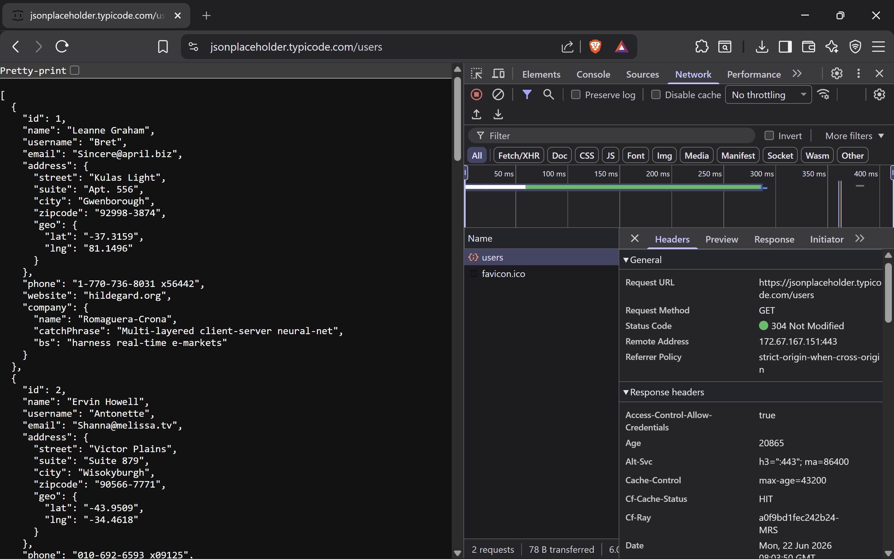
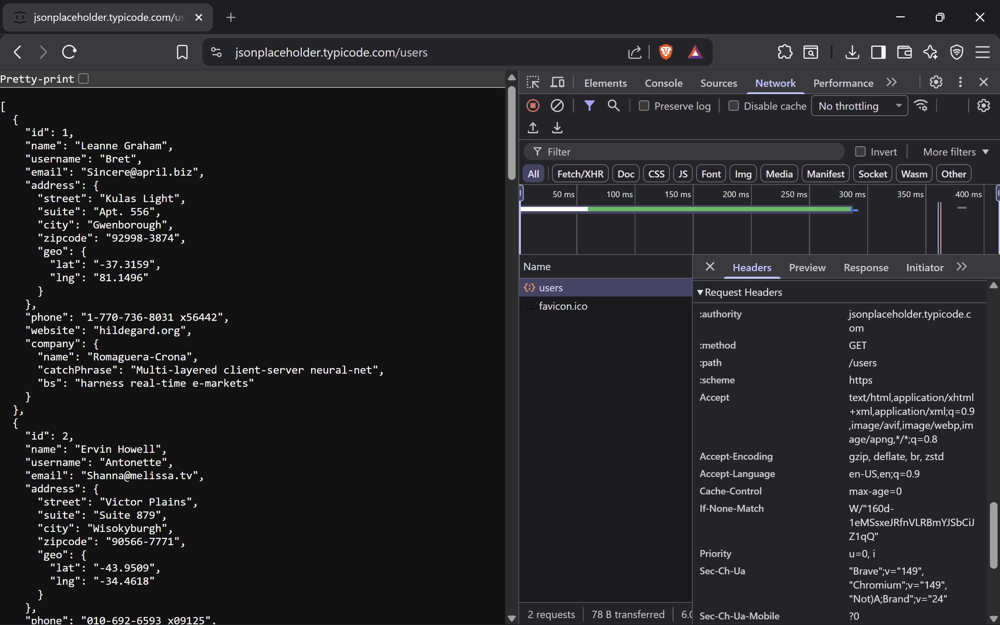

# API Security Risk Analysis

## Future Interns Cyber Security Internship

**Prepared by:** Keerit Kapoor
**Task:** Task 3 - API Security Risk Analysis
**Assessment Date:** 22 June 2026
**Target API:** `https://jsonplaceholder.typicode.com/users`

---

## Project Overview

This project presents a limited API security risk analysis using a public demo API endpoint and Browser Developer Tools.

The assessment reviewed the response data returned by the `/users` endpoint and inspected the corresponding request headers. The aim was to identify production security risks related to data exposure and authentication controls.

> **Important:** JSONPlaceholder is a public demonstration API. The observations in this project are educational production-risk scenarios, not confirmed vulnerabilities or a claim that the demo API has been breached.

---

## Objective

* Review API response data for potential excessive data exposure.
* Analyse visible authentication indicators in API requests.
* Explain API security risks in simple, business-friendly language.
* Recommend practical controls for a production API.

---

## Scope

| Item              | Details                                                                                                                  |
| ----------------- | ------------------------------------------------------------------------------------------------------------------------ |
| Target            | `https://jsonplaceholder.typicode.com/users`                                                                             |
| Endpoint reviewed | `GET /users`                                                                                                             |
| Tool used         | Browser Developer Tools                                                                                                  |
| Assessment type   | Limited, non-intrusive API risk analysis                                                                                 |
| Out of scope      | POST, PUT, DELETE, fuzzing, rate-limit testing, injection testing, credential testing, and authorization bypass attempts |

---

## Evidence 1: API Response Review



The endpoint returns broad user-profile objects containing fields such as:

* Name and username
* Email address and phone number
* Street address, city, and postal code
* Geographic coordinates
* Website and company information

---

## R-01: Potential Excessive Data Exposure

**Risk Rating:** Medium
**Status:** Production-risk scenario

### Description

The visible response includes multiple categories of user-profile information. In a real production API, returning more fields than a client requires may create unnecessary privacy and security exposure.

### Potential Impact

* Unnecessary user data may be available to client applications.
* Extra data can be exposed through logs, screenshots, analytics, or compromised devices.
* Attackers may gain more useful information for social engineering or profiling.

### Recommendations

* Return only fields required by the requesting client.
* Use endpoint-specific response schemas.
* Separate public profile data from private account data.
* Review API responses during code review and change management.

---

## Evidence 2: Request Header Review



The observed request shows standard browser headers and no visible `Authorization`, Bearer token, API key, or session credential header.

---

## R-02: Unauthenticated User-Style Resource Access

**Risk Rating:** Medium
**Status:** Production-risk scenario

### Description

The public demo endpoint responded to a `GET /users` request without a visible authentication header.

This is expected for a public testing API. However, in a real production environment, endpoints returning private or user-specific data should require suitable authentication and authorization checks.

### Recommendations

* Require authentication for private and user-specific resources.
* Apply object-level authorization checks for every requested record.
* Use short-lived tokens and least-privilege access scopes.
* Return generic errors that do not reveal unnecessary information.

---

## Controls Requiring Authorised Validation

The following areas were not actively tested because this project used a safe, non-intrusive approach:

| Control Area           | Recommended Production Control                                         |
| ---------------------- | ---------------------------------------------------------------------- |
| Rate Limiting          | Apply per-user, per-IP, and endpoint-specific limits                   |
| Input Validation       | Use strict schemas, type checks, length limits, and allowlists         |
| Object Authorization   | Validate resource ownership for every object-level request             |
| Logging and Monitoring | Log authentication failures, access denials, and unusual request rates |

---

## Key Recommendations

1. Enforce authentication and authorization before returning real user records.
2. Minimise API response data for each endpoint and user role.
3. Implement rate limiting, request-size controls, and strict input validation.
4. Monitor unusual request patterns and authorization failures.

---

## Repository Structure
## Full Report

[Open the full API Security Risk Analysis Report](API_Security_Risk_Analysis_Keerit_Kapoor.pdf)

```text
FUTURE_CS_03/
│
├── README.md
├── API_Security_Risk_Analysis_Keerit_Kapoor.pdf
│
└── screenshots/
    ├── api_users_response.png
    └── api_no_auth_evidence.png
```

---

## Skills Demonstrated

* API response analysis
* Request-header inspection
* Data-minimisation review
* Authentication and authorization analysis
* API security reporting
* Risk classification and remediation planning

---


## Disclaimer

This repository is for educational and internship-portfolio purposes only. The target is a public demonstration API. No destructive, intrusive, or unauthorised testing was performed.
